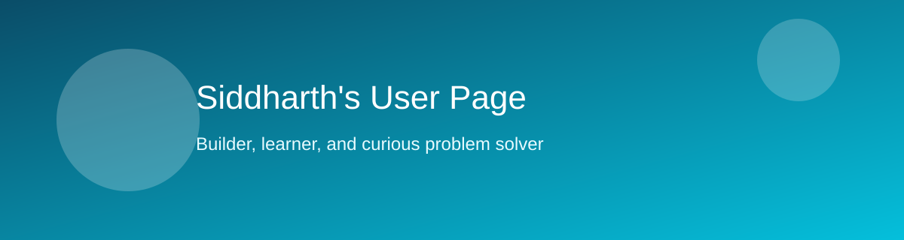

# Siddharth's User Page



Welcome! I enjoy building projects that are useful, readable, and fun to maintain.

## Quick Navigation

- [Jump to About Me](#about-me)
- [Jump to Programmer Side](#programmer-side)
- [Jump to Personal Side](#personal-side)
- [Jump to Projects](#projects)
- [Jump to Markdown Showcase](#markdown-showcase)

## About Me

Hi, I am Siddharth. As a programmer, I like learning by shipping small features and improving them over time.

As a person, I value curiosity, consistency, and helping teammates unblock quickly.

## Programmer Side

### Languages and Tools

- Python
- JavaScript
- Git and GitHub
- Markdown for clear documentation

### Current Goals

1. Improve Full-Stack Skills.
2. Write cleaner code.
3. Improve the project documentation quality.

### Weekly Plan (Task List)

- [x] Create a new branch for this assignment
- [x] Update README with progress
- [x] Build a Markdown user page
- [ ] Publish via GitHub Pages
- [ ] Share final URL

## Personal Side

> "Small improvements are the best way to have long-term growth."

I like learning through doing a lot of personal side-projects, and additonally working on leetcode problems. 

## Projects

- [Repository README](README.md)
- [View local banner image file](assets/profile-banner.svg)
- [GitHub](https://github.com)

## Markdown Showcase

Here is styled text: **bold**, *italic*, ~~strikethrough~~, and `inline code`.

### Quoting Code

```python
# Simple example: sum of squares from 1 to n
n = 5
result = sum(i * i for i in range(1, n + 1))
print(result)
```

### Task Lists

- Coding
- Writing
- Communicating

1. Plan Steps
2. Build Steps
3. Review Steps

### Table

| Area | Focus | Status |
| --- | --- | --- |
| Coding | Problem solving | In progress |
| Writing | Documentation | Improving |
| Collaboration | Communication | Active |

---

Thanks for visiting this page.
